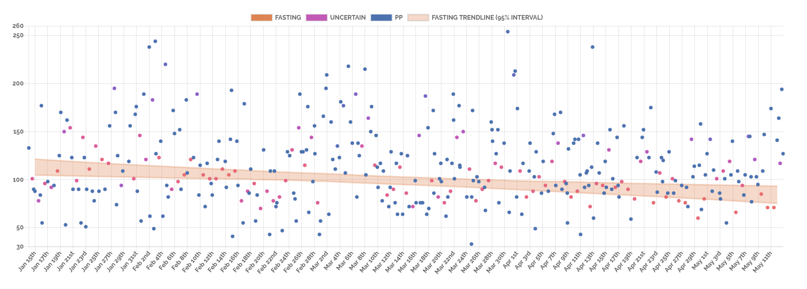

## Glucose Data

This patient's condition is slowly getting worse:

{height=300px}

## Glucose Data

This patient is steadily improving:

{height=300px}

## Insight

Can your algorithm see the signal in the noise?

## Insight

Ours can.

## Noise

{height=300px}

## Signal

{height=300px}

## Noise

{height=300px}

## Signal

{height=300px}

## Goal

Delivering medecine means improving outcomes: reducing hospitalizations and serious complications from diseases. In order to do that, we need to take into consideration the following causal chain of events: 

**\alert{actions}** -> **\alert{disease}** -> **\alert{outcomes}**

Data-driven healthcare requires good data in each category. 

## Partners

Kannact is a healthcare technology startup in the US delivering active care management to diabetes and other chronic care patients.

Each diabetes patient in their program is assigned a 4g-connected glucometer and a personal health coach.

Kannact collects a lot of data about their patients and they shared it all with us.

## Data

Their data can be organized into the three categories of interest: 

**\alert{ACTIONS}** Phone calls and messages with coaches, exercise data from mobile health applications, medecine intake, glucose readings. Supporting factors include data on psychological profile (via behavioral survey), age, and information on comorbidites.

**\alert{DISEASE}** Glucose readings, other biometrics (weight, blood pressure, etc.)

**\alert{OUTCOMES}** Insurance claims, notes from coaches.

## Goal

The whole process of **\alert{actions}** -> **\alert{outcomes}** can take, literally, a lifetime. 

For example, poor eating habits of an early-stage diabetes patient can easily take more than 20 years before it leads to kidney failure. Thus, **learning the system end-to-end will be slow and inefficient**. 

Luckily, science has provided us with _alot_ of knowledge about the mechanism **\alert{disease}** -> **\alert{outcomes}**.

## Diabetes

In the case of early- and mid-stage type II diabetes, science tells us that **increased insulin resistance** in the body's cells causes negative outcomes.

Thus, learning the mechanism **\alert{actions}** -> **\alert{insulin resistance}** will be both **efficient** (targeted) and **effective** (scientifically sound causal mechanism). 

## Insulin Resistance

Changes in insulin resistance evolve slowly over time. 

Measuring these changes via periodic and expensive lab tests, of glucose and hemoglobin A1c, is well-proven and effective. 

Efficiently learning the mechanism **\alert{actions}** -> **\alert{insulin resistance}**, however, requires measuring the effect of actions at a frequency higher than implied by a bi-annual visit to the doctor to perform expensive lab tests.

## Glucose Readings

Accurately measuring medium-term changes in insulin resistance via at-home glucometers is not a solved problem.

It is a prerequisite for effective learning of the **\alert{actions}** -> **\alert{disease}** mechanism.

It is also the goal of this project. 

## Measure medium-term trends

In order to measure medium-term trends in disease state we need:

1. A measurement that can change smoothly over time, picking up local, nonlinear trends at any time, while being robust to both potentially incorrect data and data that comes from a distribution with very heavy tails and skewness. 

2. The ability to separate different trends from the readings.

## Why robust? 

A diabetes patient will occasionally have some high readings. 

How can we know if those high readings come from isolated events (a couple meals on vacation) and how can we know if they represent part of a problematic trend (their cells' resistence to insulin is increasing)?

We need a framework that can separate those two cases. Any framework that relies on averages or makes statistical assumptions of Gaussianity will fail to separate them. 

## Why separate the trends? 

We build separate trends for \alert{fasting} and \alert{postprandial} glucose readings.

Why? 

These readings indicate different, if related, biological processes. Postprandial readings are more directly influenced by meals and behavior, while fasting readings provide a cleaner view into the long-term biological state of the patient. 

Different trends require different interventions.

## Missing Data

In the lab and in medical studies, we know exactly which glucose readings are fasting and which are postprandial. 

In the data that our partner company, Kannact, has, we rarely know for sure. 

Patients only sometimes label their glucose readings. Their glucometers, like many glucometers, allow them to label readings as "pre" or "post" meal, but do not have a special indicator for "fasting".

Thus, in addition to finding the trends over time, our method must be able to infer which readings belong to which trend. 

