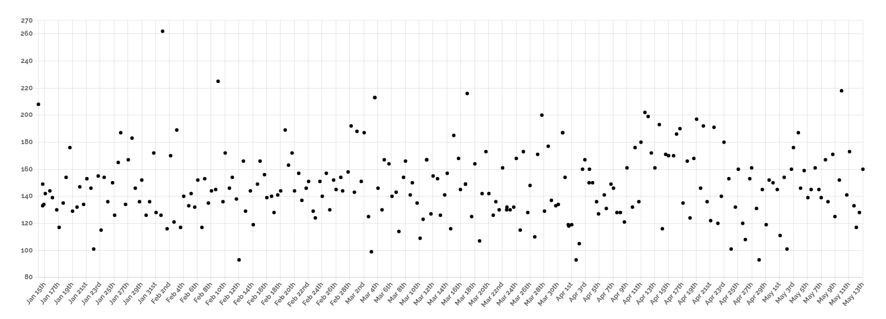
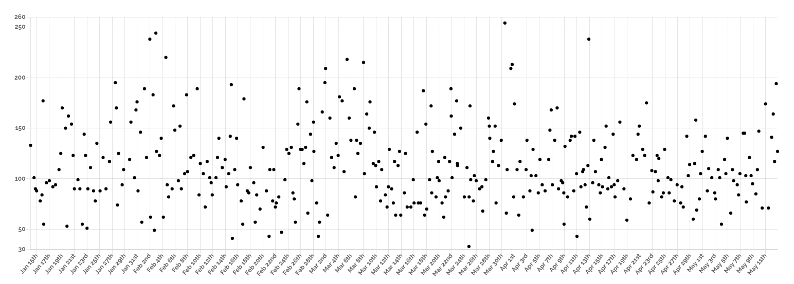
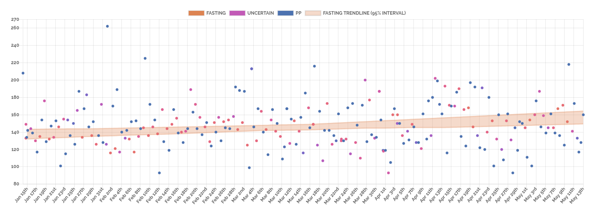
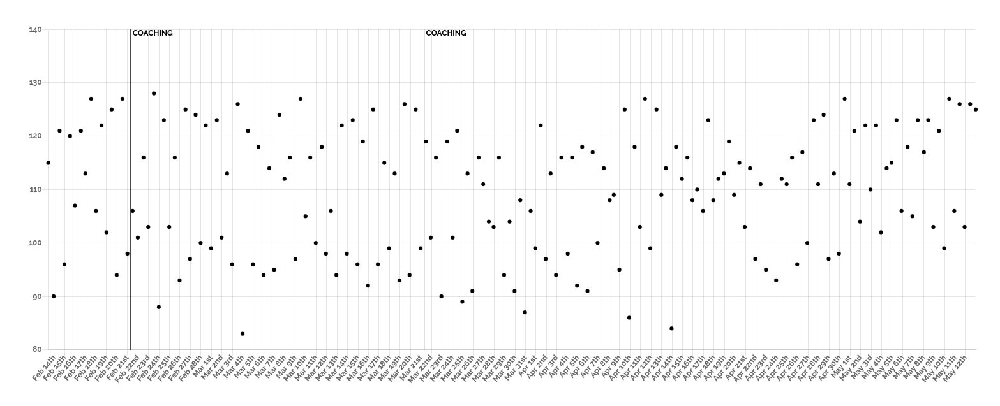
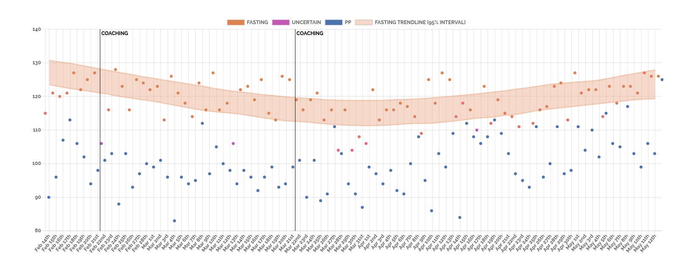
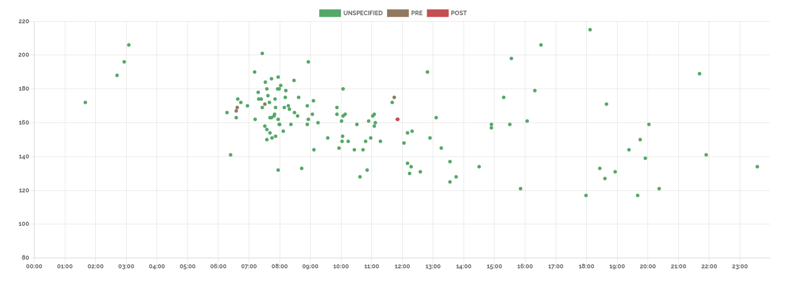
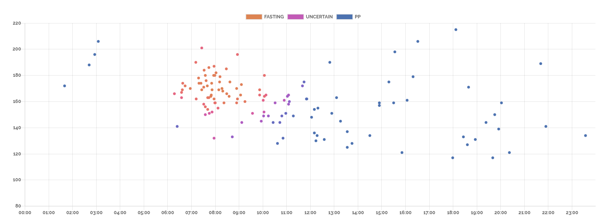
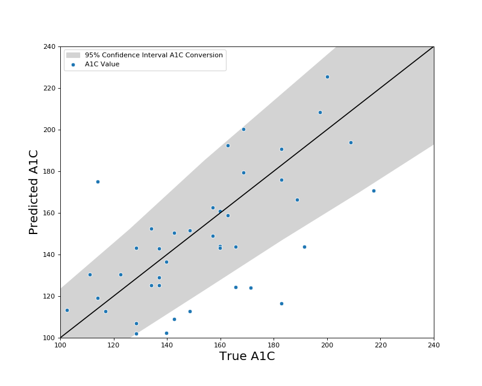

## To compile

Just run: 

```
make
```

In the root folder. You will need to have the following installed on your machine: 

* Make
* Pandoc
* TexLive
* [This BGSE theme](https://github.com/bgsedatascience/bgse-beamer-theme) available to TexLive

---
title: Active Care for Diabetes Patients
author: Barcelona GSE Data Science Center
date: May, 2019
---


## Partners

{width=350px}


{width=200px}


## Glucose Data

This patient's condition is slowly getting worse:


{height=300px}

## Glucose Data

This patient is steadily improving:

{height=300px}


## Insight

Can your algorithm see the signal in the noise?

## Insight

Ours can.


## Noise

{height=300px}

## Signal

{height=300px}


## Noise

{height=300px}

## Signal

{height=300px}


## Noise is a reality


Active management of large diabetes populations requires cheap, frequent data.

Cheap, frequent data, for diabetes patients, will always include user-generated glucose readings.

User-generated data is noisy. It's important to develop models that can see through that noise.


## Where does the noise come from?

FDA approval of at-home glucometers requires them to produce 99\% of their readings within 20\% of lab results.

Thus, a patient with a true fasting glucose level of 100 mg/dL could have a reading between 80-120 mg/dL, a range of 40 mg/dL.

## Where does the noise come from?

Glucose readings are highly affected by meals and exercise of the patient.

Even after the same meal, the patient might take the reading 1.5h after, 3h after, 7h after, or 11h after.

The state of the patient's disease is the same, but the glucose reading will be wildly different.

## Short-termism

Many commercial offerings in personal glucose management focus on short-term changes in glucose,

In particular, they often focus on the changes in glucose due to individual meals, or changes within a day.

## Short-termism

{height=250px}


## Short-termism

While helping patients understand how different meals affect their body is important, this does not actually help a patient understand the cumulative effect of a recently-changed diet.


## Long-termism

Hemoglobin A1c tests have gained popularity among doctors treating diabetes patients in recent years.

Hemoglobin A1c tests are _not_ a more direct measure of insulin resistence than blood glucose, but they are less effected by noise from recent diet and exercise than lab glucose tests.

Doctors value this reduction in noise.


## Long-termism

A1c tests are expensive and only performed at best every 3-6 months, but give reliable measures of long-term trends.

6 months is a long time for a patient to wait to see if their recently-changed exercise routine is working or not.

A1c tests provide a clean, reliable signal. But not a frequent signal.


## Medium-termism

Accurately measuring medium-term changes in insulin resistance via at-home glucometers is not a solved problem.

It is a prerequisite for effective learning of the relationship between patient behavioral regimes and disease state.

It is also the goal of this project.


## Partners

Kannact is a healthcare technology startup in the US delivering active care management to diabetes and other chronic care patients.

Each diabetes patient in their program is assigned a 4g-connected glucometer and a personal health coach, who talks with them about once per month.

Kannact collects a lot of data about their patients and they shared it all with us.


## Medium-term success

This is one of Kannact's patients. They missed a coaching appointment in April.

{height=300px}


## Medium-term success

Without our algorithm, however, Kannact could not have known that the patient, previously improving with coaching, started to get worse after April:

{height=300px}

## Medium-term success

In this example, our algorithm is able to detect a decline in disease state even without any individual large readings.

Similarly, it can detect improvements in the disease state _despite_ individual large readings.

## Medium-term success

{height=300px}


## Medium-term success

Focusing on recovering medium-term trends gives us a measurement of the disease that is _robust_ to behavioral noise in the same way as a hemoglobin A1c lab test, while being available in _real time_ from at-home glucometers.

## Secret Sauce

The success of our methodology for recovering medium-term trends from at-home glucometer data is based on tackling two individual challenges that, as far as we know, have not yet been formally addressed in the literature or industry:

1. Recovering different glucose types (fasting vs. postprandial) in the face of missing labels from the patient.

2. Accurately modeling trends over time in the face of glucometer- and patient-induced noise.

## Algorithm

Our methodological contribution in modeling glucose data consists of a novel mixture model:

* Glucose data is modeled as a mixture of two components: fasting/postprandial.
* Each component has two dimensions: time-of-day and mg/dL, independent conditional on label.
* The location parameter of the mg/dL distributions evolves smoothly over time.
* The model is fit via a novel EM algorithm.


## Why Are Labels Missing?

In medical studies, we know exactly which glucose readings are fasting and which are postprandial. In the real world, data is not so clean. Patients only sometimes label their glucose readings.

In Kannact's data, the glucometers, like many glucometers, allow patients to label readings as "pre" or "post" meal, but do not have a special indicator for "fasting".

Thus, while we want to recover separate trends for fasting and postprandial readings, we first need to infer which readings are which, potentially taking advantage of the (imperfect) labels we have.


## Label Recovery - Before

{height=300px}


## Label Recovery - After

{height=300px}


## Distributions

The components of the mixture model are formulated in 2 independent dimensions:

* We learn the "wakeup time" for each person, the time when fasting readings take place, modeled as a Beta distribution. Postprandial time is modeled as Uniform(0,24).

* Glucose levels exhibit heavy tails. Postprandial readings have large positive excursions. We learn a symmetric and asymmetric Laplace distribution respectively.

* To allow a smooth time trend in the location parameter of the glucose distributions, we run mode regression on a Fourier basis transformation of the date value.

See [[**Appendix 1**]{.smallcaps}](#maths) for mathematical formalization.


## Model

{height=150px}

Example of the symmetric and asymmetric Laplace distributions. Both have heavy tails. The asymmetric version allows for postprandial readings to have heavy skewness. This allows us to robustly model the evolution of the location over time in the face of such noise.


## Solving the Model

We develop a novel EM algorithm tailored to our model, which is non-standard in two ways:

1. Uses mode regression to model evolution of the location parameters of the Laplace distribution over time.

2. Semi-supervised by allowing hard-assigned labels when deemed "reliable".

See associated paper and code for details on implementation.


## Solving the Model

Information criteria is used to pick the number of bases in the regression, allowing complexity of non-linearities in the trend to differ per patient.

The evolution of the location parameters is reported with 95% confidence intervals created via bootstrap resampling of the location regression.

Reporting the uncertainty allows coaches to see when a patient is taking enough readings to recover the trend. The uncertainty itself is actionable and valuable.

## Conclusions

Fasting, and postprandial levels represent a combination of information about user behavior and information about the biological transformations happening in the system of a diabetes patient.

Recovering the medium-term trends in the latter are needed to allow patients to see feedback from their exercise and diet regimes.

A focus on recovering medium-term trends is sorely lacking in both medical literature and commercial offerings.

Our probabilistic model successfully separates the signal from the noise and recovers this trend.


## Future Research

Recovering the medium-term trends of the underlying biological process is an important first step that opens up many exciting opportunities:

* Explore reliable predictions of A1c scores using the fasting/postprandial evolution (See [[**Appendix 2**]{.smallcaps}](#predictions) for promising initial results).

* Test for effectiveness of interventions (coaching sessions).

* Test for effectiveness of program with regards to covariates of interest (psychological profiles).

* Test effectiveness of diet and exercise given appropriate data (mobile health apps).


## Summary

Accenture asked us to for a novel solution to Diabetes care and Kannact brought us messy, patient-generated glucose data.

We turned it into trends, with full uncertainty quantification, uncovering the evolution of the biological process underlying their patients’ diabetes in a realtime dashboard.

{height=150px}


## Appendix 1 - Model {#maths}

For each patient, we learn the following model:

Let $y_{ij}$ be the $i^{th}$ glucose reading on date $j$ and time $t_{ij} \in [0,24]$.

Let $z_{ij} \in {1,2}$ be the latent fasting/postprandial label. We formulated the following mixture model in two dimensions (glucose and time):

$$
(y_{ij}, t_{ij} | z_{ij} = 1) \sim Laplace(\mu_{1 j}, \sigma_1), \ Beta(\alpha, \beta)
$$
$$
(y_{ij}, t_{ij} | z_{ij} = 2) \sim Laplace(\mu_{2 j}, \sigma_{2}, \delta_{2}), \ Unif(0, 24)
$$

Where we assume $y_{ij} \perp t_{ij} \ | \ z_{ij}$.

## Appendix 1 - Model

In order to allow changes over time, we learn the location parameters, $\mu$, as a function of the date. This is done via mode regression on a fourier-basis transformation of the date value:
$$
\mu_{k, j} = \sum_{n=0}^{N} w_n \phi_{n}(j)
$$

Where $w_n$ is a learned coefficient for basis expansion $n$, $j$ is the date, and $\phi_n$ is defined as:
$$
\phi_0(t) = \frac{1}{\sqrt{2}} \ \ \ \ \
\phi_{2n-1}(t) = \sin \bigg( \frac{2 \pi n}{T} t \bigg)  \ \ \ \ \
\phi_{2n}(t) = \cos \bigg( \frac{2 \pi n}{T} t \bigg)
$$


## Appendix 2 - A1c Predictions {#predictions}

Well-controlled medical studies comparing A1C scores with average fasting and postprandial readings suggest that the correlations between readings and A1c scores should be:

1. For fasting levels, between .46 and .71, the upper end being for populations known to have diabetes. We recovered .66 with our model and patients.

2. For postprandial levels, between .33 and .79. We recovered .54 with our model and patients.

We can also formulate a linear model and find that on our small sample of patients, using our fitted distributions outperforms the average of all readings (see associated paper).

## Appendix 2 - A1c Predictions

{height=180px}

Actual and predicted A1C value based on linear model using expected fasting and postprandial levels, shaded area shows 95 percent confidence interval for A1c-glucose conversion.

## References

Organization, World Health, and others. 2006. "Definition and
Diagnosis of Diabetes Mellitus and Intermediate Hyperglycaemia:
Report of a Who"

Dempster, Arthur P, Nan M Laird, and Donald B Rubin. 1977.
“Maximum Likelihood from Incomplete Data via the EM
Algorithm.” Journal of the Royal Statistical Society: Series B
(Methodological) 39 (1): 1–22.

Yu, Keming, and Rana A. Moyeed. 2001. “Bayesian Quantile
Regression.” Statistics & Probability Letters 54 (4): 437–47.

Rossell, David, and Mark Steel. 2017. “Continuous Mixtures with
Skewness and Heavy Tails.” In G. Celeux, S. Fruhwirth-Schnatter,
and C. P. Robert, editors, Handbook of mixture analysis, chapter 10
CRC press, 2018.


## References


Rossell, David, and Francisco J Rubio. 2018. “Tractable Bayesian
Variable Selection: Beyond Normality.” Journal of the American
Statistical Association 113 (524): 1742–58.

Monnier, Louis, Claude Colette, Louis Monnier, and Claude
Colette. 2006. “Contributions of Fasting and Postprandial
Glucose to Hemoglobin A1c.” Endocrine Practice 12 (Supplement
1): 42–46.

Van’t Riet, Esther, Marjan Alssema, Josina M Rijkelijkhuizen, Piet
J Kostense, Giel Nijpels, and Jacqueline M Dekker. 2010.
“Relationship Between A1c and Glucose Levels in the General
Dutch Population: The New Hoorn Study.” Diabetes Care 33 (1):
61–66.

## References

Nathan, David M, Judith Kuenen, Rikke Borg, Hui Zheng, David
Schoenfeld, and Robert J Heine. 2008. “Translating the A1c
Assay into Estimated Average Glucose Values.” Diabetes Care 31
(8): 1473–8.
