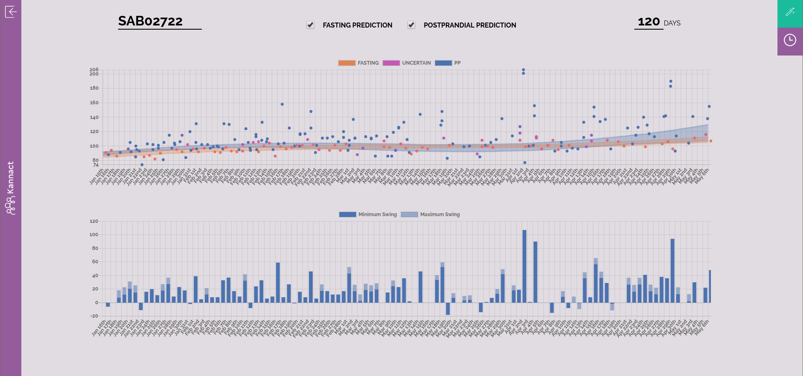
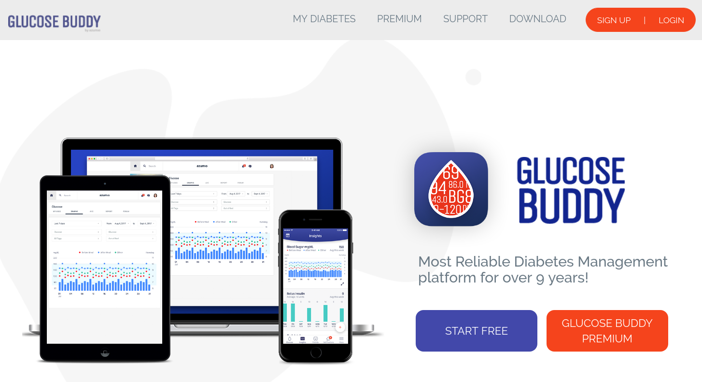
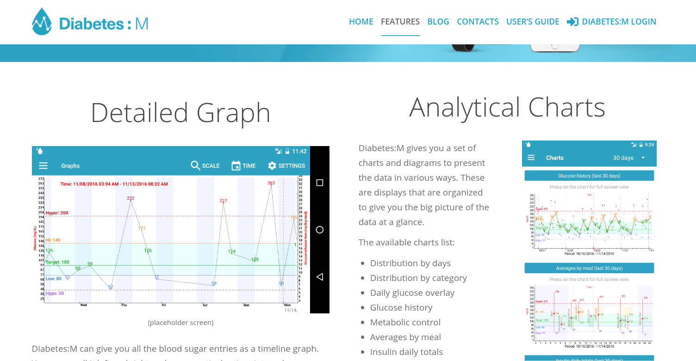
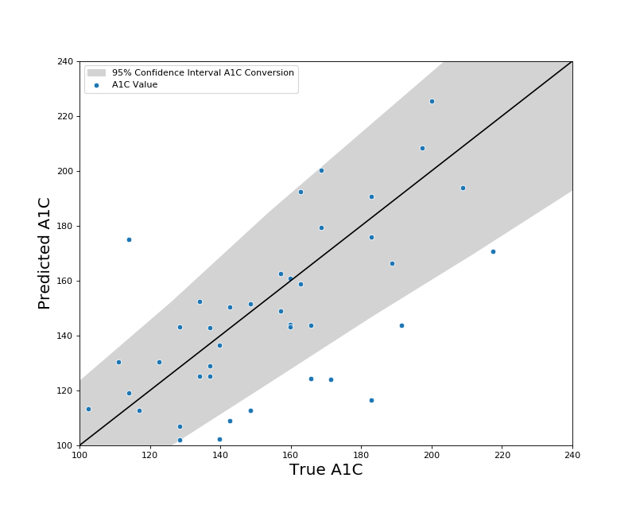

## Outline

* Project Goals and Results
* Subsets of Diabetes Patients
* Glucometers and Historical Problems in the Industry
* Model

---

## Project Goal

Create a tool for active management of diabetes patients in large populations.

---

## Project Results

{height=300px}

---

## Project Results

The dashboard enables:

* Active-management professionals (health coaches and doctors) to monitor the evolution of key variables for early- and mid-stage type II diabetes patients.

* Coaches and patients to see the effects of short-term diet and exercise behaviors on mid- and long-term evolution of the biological process underlying the disease.

* Coaches and patients to see the quality, regularity, and reliability of the blood-glucose readings taken by the patient and the effects of improving.

---

## Project Results

The dashboard displays data on blood glucose levels.

* Blood glucose levels are the primary and most important data for monitoring diabetes.

* They are recorded from self-administered blood tests by patients via a glucometer.

* Blood glucose levels are a noisy signal of multiple biological processes happening simultaneously.

---

## Project Results

From the noisy signal of raw glucose levels, the dashboard presents the inferred variables that align with the medical theory on managing type II diabetes:

1. Fasting glucose levels and their evolution over time.
2. Postprandial glucose levels and their evolution over time.
3. Daily "swings" in glucose levels that causes cardiovascular stress to the system.

---

## Project Results

Technical results needed to build the dashboard and present these variables in a usable manner:

* Infer the "type" of blood-glucose reading from the raw output provided by the glucometer (fasting/postprandial).

* Model the distributions of the the inferred glucose reading types for each patient.

* Model the evolution of the glucose distributions for each patient over time, including prediction and interpolation when missing readings.

---

## Background

Why are those variables important?

---

## Diabetes

\alert{Type I Diabetes}

Autoimmune condition, also called juvenile-onset diabetes. Body attacks pancreas which stops secreting insulin.

&nbsp;

\alert{Type II Diabetes}

Cells develop insulin resistence, causing pancreas to work harder to secret more insulin which over time can damage the pancreas (as well as other complications).

---

## Type II Diabetes

Type II diabetes is diagnosed (and monitored) through the following tests:

1. Glucose level in the blood after fasting for 8-10 hours (>125 mg/dl).
2. Glucose level in the blood 2 hours after drinking a special sugar-water concoction (> 199mg/dl).
3. Hemoglobin A1C test (> 6.5%). This measures your average glucose levels for the past 2-3 months, or in other words, a mixture of #1 and #2.

---

## Type II Diabetes

\alert{Prediabetes and Early-stage Type II Diabetes} patients are primarily prescribed "diet and exercise" to reduce glucose levels to a healthy range.

\alert{Mid-stage Type II Diabetes} patients take oral medication (such as Metformin) to increase the cells' ability to absorb glucose, as diet and exercise alone did not prove effective.

\alert{Late-stage Type II Diabetes} patients inject insulin after meals to help absorb glucose into their cells, as their system no longer responds well enough to oral medications.

---

<!-- ## Type II Diabetes - Treatment -->

<!-- Treatment of early- and mid-stage type II diabetes boils down to helping reduce the workload on the pancreas by decreasing the system's need for insulin. This is primarily done in two ways: -->

<!-- 1. Decrease the amount of glucose in the blood that cells need to absorb at any one time (diet). -->
<!-- 2. Increase the cells' ability to absorb blood glucose (exercise and oral medications). -->

<!-- --- -->

## Type II Diabetes - Treatment

Treatment is deamed effective if:

1. Fasting glucose levels return to a "healthy" level.
2. Postprandial glucose levels return to a "healthy" level.
3. Hemoglobin A1C levels return to a "healthy" level.

(Or, if they don't get better, they at least stop getting worse)

## Type II Diabetes - Treatment

Doctors check the glucose levels and run A1C tests every 3-6 months, to see if the treatment is working for the patient.

## Type II Diabetes - Treatment

3-6 months is a long time to wait just to see if your new, painful diet and exercise routine are having any impact on your disease.

And if they haven't, you don't have many 3-6 month iterations before you get put on medication.

## Type II Diabetes - Data

Blood glucose levels at any point in time are caused by two factors:

1. The amount of glucose dumped into the blood when the patient eats.
2. The amount of glucose absorbed from the blood by the cells.

In the tests to determine how the disease is developing, #1 is minimized or controlled. It's noise.

#1, however, contains information about the behavior of the patient and their diet.

## Type II Diabetes - Data

It's important to understand that take-home glucometers have historically been seen as useful for #1, determining the effect of food.

## Marketing Screenshot (Glucometer)

{height=300px}

## Marketing - Glucose Management

There is a bonanza of new apps to help people manage their diabetes.

Similarly, they focus on short-term changes in glucose, the effects of individual food items on glucose changes, and, at best, averages, without truly trying to measure medium-term trends in the levels that matter.

## Marketing Screenshot (App)

{height=300px}

## Marketing Screenshot (App)

{height=300px}

## Marketing Screenshot (App)

{height=300px}

## Medium-term Trends

Daily, or inter-daily, measurements can only reveal a very short-term trend.

At a daily level, the signal that matters for understanding the evolution of early- and mid-stage type II diabetes (the change in the cells' resistence to insulin) is lost. Biology doesn't change in 24 hours.

3-6 months is a long-term trend.

At 3-6 months, the effectiveness of a regim becomes clear, but it might be too late to change or adjust.

## Nowcasting

Hence, the need to nowcast the trends observed at a 3-6 month level, as the evolve (slowly) on a weekly basis.

## Type II Diabetes - Data

Both glucose level types (fasting/postprandial) used to diagnose diabetes are important for monitoring the disease.

Importantly, however, they are also differentially effected by the two factors expressed in blood glucose (diet and absorbtion).

This is an extremely valuable fact that can be used to extract and separate **behavior** and latent **biological state** from glucose readings alone.

## Type II Diabetes - Data

\alert{Fasting} readings can be moderately effected by meals the night before as well as exercise the day before, but are primarily an indication of the long-term state of how well the system absorbs glucose after being left alone for a long time.

\alert{Postprandial} readings (taken 2-3 hours after eating a meal), are highly effected by the previous meal and can be highly effected by post-meal exercise, but also measure how well the system absorbs glucose in the immediate period following a new infusion.

---

## Type II Diabetes - Data

We define a patient's \alert{swing} as the difference between their most extreme postprandial value and the imputed or actual fasting level for that day.

Swings are important in the medical literature as large swings cause cardiovascular damage.

However, swings also measure patient behavior on a given day: large swings indicate poor diet and lack of post-meal exercise.

---

## Process

How are fasting, postprandial, and swing levels inferred?

---

## Data

Data and inspiration for

---

## Process

In an ideal world, glucose measurements would be recorded with a label indicating whether it was "fasting" or "postprandial".

Most commercial glucometers, historically designed for insulin-taking patients, continue the tradition of having only labels for "pre-meal" or "post-meal" readings.

Some patients label all of their readings as "pre-meal" or "post-meal".

Most patients forget some of the time.

Many patients forget all of the time.

---

## Process

In order to recover the labels (fasting/postprandial) we need two dimensions:

1. The reading value
2. The time of day in which the reading took place.

And, where possible, we can take advantage of:

3. The user-provided label (pre-meal/post-meal)

---

## Model

We also want a probabilistic model that will express its uncertainty regarding the recovered labels.

A probabilistic mixture model is a natural choice.

---

## Model

For each patient, we learn the following model:

Let $y_{ij}$ be the $i^{th}$ glucose reading on date $j$ and time $t_{ij} \in [0,24]$.

Let $z_{ij} \in {1,2}$ be the latent fasting/postprandial label. We formulated the following mixture model in two dimensions (glucose and time):

p$$
(y_{ij}, t_{ij} | z_{ij} = 1) \sim Laplace(\mu^1_{j}, \sigma^1), \ Beta(\alpha_i, \beta_i)
$$
$$
(y_{ij}, t_{ij} | z_{ij} = 2) \sim Laplace(\mu^2_{j}, \sigma^2, \delta^2), \ Unif(0, 24)
$$

Where we assume $y_{ij} \perp t_{ij} \ | \ z_{ij}$.

---

## Model

In order to allow changes over time, we incorporate a change to the location parameters $\mu$ given the date.

This is done via a regression on a non-linear basis transformation of the date value:

$$
\mu^k_j = \textbf{w} \Phi ( j )
$$

Where $\textbf{w}$ is a vector of learned coefficients, $j$ is the date, and $\Phi$ represents the feature transformation function.

---

## Predictive Ability

A model is accurate insofar as it can predict.

To validate our modelling of fasting and postprandial scores, we use a record A1C test score which we have for a small subset (~44) of our patients.

---

## Predictive Ability - Correlation

A study by blah suggests that A1C scores are correlated with fasting and postprandial with correlations of X and Y respectively.

Despite not having actual labels, regular readings, and a very small sample size, we have very comparable correlation coefficients between the A1C scores and the means implied by our fitted distrubtions: 0.66 and 0.54 respectively.

---

## Predictive Ability - Regression

Similarly, a simple linear combination of the two means (fasting and postprandial) recovers a good approximation of the A1C scores up to the confidence intervals provided with the A1C test and conversion into mg/dL itself.

---

## Predictive Ability - Regression

{height=300px}

---

## Predictive Ability - Regression

Clearly, many more factors would need to be taken into account to get an accurate prediction of A1C levels for any individual.

To build such a model, it would be necessary to have multiple A1C values per patient.

However, the similarity of our results with the literature and the reasonableness of the prediction of the simple linear combination suggest that our model recovers something very close to the true underlying distribution of these glucose readings.

---
