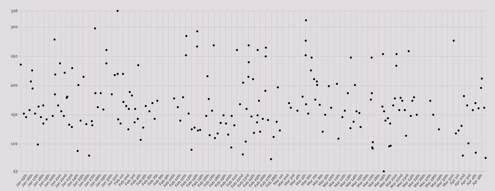
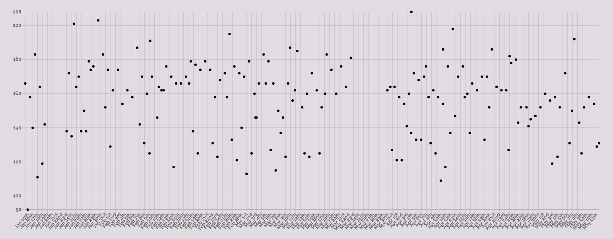
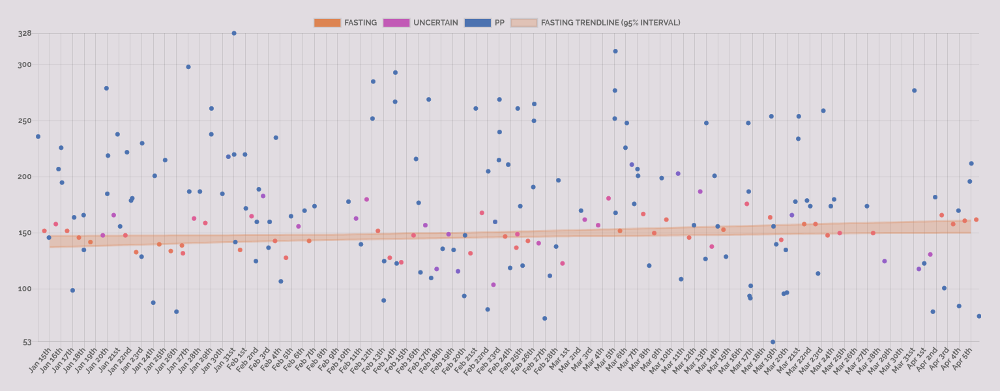
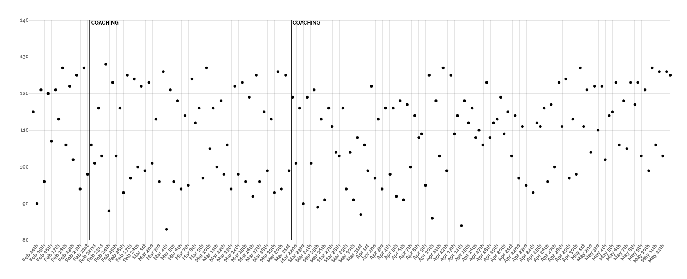
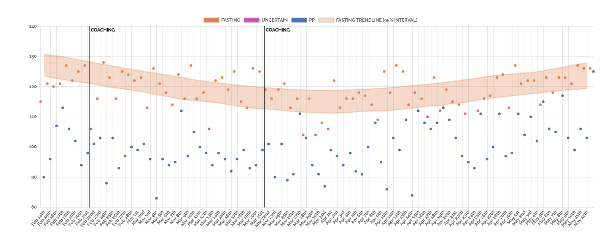

## Glucose Data

This patient's condition is slowly getting worse:

{height=300px}

## Glucose Data

This patient is steadily improving:

{height=300px}

## Insight

Can your algorithm see the signal in the noise?

## Insight

Ours can.

## Noise

{height=300px}

## Signal

{height=300px}

## Noise

{height=300px}

## Signal

{height=300px}

## What is the noise?

FDA approval of at-home glucometers requires them to produce 99\% of their readings within 20\% of lab results.

Thus, a patient with a true fasting glucose level of 100 mg/dL could have a reading between 80-120 mg/dL, a range of 40 mg/dL.

## What is the noise?

Glucose readings are highly effected by meals and exercise of the patient.

Even after the same meal, the patient might take the reading 1.5 hours after, 3 hours after, 7 hours after, or 11 hours after. The state of the patients disease is the same, but the glucose reading will be wildly different.

## Short-termism

Many commercial offerings in personal glucose management focus on short-term changes in glucose, in particular, due to individual meals.

## Short-termism

{height=300px}

## Short-termism

While helping patients understand the difference between meals is important, this does nothing to help a patient understand the cumulative effect of a recently-changed diet.

## Long-termism

Doctors, more and more, rely on hemoglobin A1c tests to determine the state of a patient's disease.

Hemoglobin A1c tests are _not_ a more direct measure of insulin resistence than blood glucose, but they are less effected by noise from recent diet and exercise than lab glucose tests.

## Long-termism

A1c tests are expensive and only performed at best every 3-6 months, but give reliable measures of long-term trends.

6 months is a long time for a patient to wait to see if their recently-changed exercise routine is working or not.

## Medium-termism

Accurately measuring medium-term changes in insulin resistance via at-home glucometers is not a solved problem.

It is a prerequisite for effective learning of the relationship between patient behavioral regimes and disease state.

It is also the goal of this project.

## Partners

Kannact is a healthcare technology startup in the US delivering active care management to diabetes and other chronic care patients.

Each diabetes patient in their program is assigned a 4g-connected glucometer and a personal health coach, who talks with them about once per month.

Kannact collects a lot of data about their patients and they shared it all with us.

## Medium-term success

This is one of Kannact's patients. They missed a coaching appointment in April.

{height=300px}

## Medium-term success

Without our algorithm, however, Kannact could not have known that the patient, previously improving with coaching, started to get worse after April:

{height=300px}

## Medium-term success

In this example, our algorithm is able to detect a decline in disease state even without any individual large readings.

Similarly, it can detect improvements in the disease state _despite_ individual large readings.

## Medium-term success

{height=300px}

## Secret Sauce

The success of our methodology for recovering medium-term trends from at-home glucometer data is based on tackling two individual challenges that, as far as we know, have not yet been formally addressed in the literature or industry:

1. Recovering different glucose types (fasting vs. postprandial) in the face of missing labels from the patient.

2. Accurately modeling trends over time in the face of glucometer- and patient-induced noise.

## Model

We formulate a two-component mixture model in two dimensions (mg/dL and time of day):

* We learn the "wakeup time" for each person while allowing postprandial readings at any time in the day: time is thus a Beta for fasting, and uniform for postprandial.

* Glucose levels exhibit heavy tails. Postprandial readings have large positive excursions. We thus learn a symmetric and asymmetric Laplace distribution respectively.

* To recover the smooth time trend in the location parameter of the glucose distributions, we run mode regression on a Fourier basis transformation of the date value.

See [[**Appendix 1**]{.smallcaps}](#maths) for mathematical formalization.

## Model

{height=180px}

Example of the symmetric and asymmetric Laplace distributions.

## Solving the Model

We develop a novel EM algorithm tailored to our model, which is non-standard in two ways:

1. Uses mode regression to model evolution of the location parameters of the Laplace distribution over time.

2. Semi-supervised by allowing hard-assigned labels when deemed "reliable".

See associated paper and code for details on implementation.

## Solving the Model

The number of Fourier bases used to represent the time evolution is chosen using information criteria, allowing complexity of non-linearities in the trend to differ per patient.

The evolution of the location parameters is reported with 95% confidence intervals created via bootstrap resampling of the location regression given the best basis function. This crucially allows coaches to see when a patient is taking enough readings to recover the trend.

## Conclusions

Fasting, and postprandial levels represent a combination of information about user behavior and information about the biological transformations happening in the system of a diabetes patient.

Recovering the medium-term trends in the latter are needed to allow patients to see feedback from their exercise and diet regimes.

A focus on recovering medium-term trends is sorely lacking in both medical literature and commercial offerings.

A probabilistic model is necessary to separate signal from noise and provide it in a usable way for health coaches.

## Future Research

Recovering the medium-term trends of the underlying biological process is an important first step that opens up many exciting opportunities:

* Explore reliable predictions of A1c scores using the fasting/postprandial evolution (See [[**Appendix 2**]{.smallcaps}](#predictions) for promising initial results).

* Test for effectiveness of interventions (coaching sessions).

* Test for effectiveness of program with regards to covariates of interest (psychological profiles).

* Test effectiveness of diet and exercise given appropriate data (mobile health apps).

## Appendix 1 - Model {#maths}

For each patient, we learn the following model:

Let $y_{ij}$ be the $i^{th}$ glucose reading on date $j$ and time $t_{ij} \in [0,24]$.

Let $z_{ij} \in {1,2}$ be the latent fasting/postprandial label. We formulated the following mixture model in two dimensions (glucose and time):

$$
(y_{ij}, t_{ij} | z_{ij} = 1) \sim Laplace(\mu^1_{j}, \sigma^1), \ Beta(\alpha_i, \beta_i)
$$
$$
(y_{ij}, t_{ij} | z_{ij} = 2) \sim Laplace(\mu^2_{j}, \sigma^2, \delta^2), \ Unif(0, 24)
$$

Where we assume $y_{ij} \perp t_{ij} \ | \ z_{ij}$.

## Appendix 1 - Model

In order to allow changes over time, we learn the location parameters, $\mu$, as a function of the date.

This is done via a regression on a non-linear basis transformation of the date value:

$$
\mu^k_j = \textbf{w} \Phi ( j )
$$

Where $\textbf{w}$ is a vector of learned coefficients, $j$ is the date, and $\Phi$ represents the feature transformation function, in this case, a Fourier basis. given the date.

## Appendix 2 - A1c Predictions {#predictions}

Well-controlled medical studies comparing A1C scores with with average fasting and postprandial readings suggest that the correlations between readings and A1c scores should be:

1. For fasting levels, between .46 and .71, the upper end being for populations known to have diabetes. We recovered .66 with our model and patients.

2. For postprandial levels, between .33 and .79. We recovered .54 with our model and patients.

We can also formulate a linear model and find that on our small sample of patients, using our fitted distributions outperforms the average of all readings (see associated paper).

## References

Organization, World Health, and others. 2006. "Definition and
Diagnosis of Diabetes Mellitus and Intermediate Hyperglycaemia:
Report of a Who"

Dempster, Arthur P, Nan M Laird, and Donald B Rubin. 1977.
“Maximum Likelihood from Incomplete Data via the Em
Algorithm.” Journal of the Royal Statistical Society: Series B
(Methodological) 39 (1): 1–22.

Yu, Keming, and Rana A. Moyeed. 2001. “Bayesian Quantile
Regression.” Statistics & Probability Letters 54 (4): 437–47.

Russel, David, and Mark Steel. 2017. “Continuous Mixtures with
Skewness and Heavy Tails.”

## References

Rossell, David, and Francisco J Rubio. 2018. “Tractable Bayesian
Variable Selection: Beyond Normality.” Journal of the American
Statistical Association 113 (524): 1742–58.

Monnier, Louis, Claude Colette, Louis Monnier, and Claude
Colette. 2006. “Contributions of Fasting and Postprandial
Glucose to Hemoglobin A1c.” Endocrine Practice 12 (Supplement
1): 42–46.

Van’t Riet, Esther, Marjan Alssema, Josina M Rijkelijkhuizen, Piet
J Kostense, Giel Nijpels, and Jacqueline M Dekker. 2010.
“Relationship Between A1c and Glucose Levels in the General
Dutch Population: The New Hoorn Study.” Diabetes Care 33 (1):
61–66

## References

Nathan, David M, Judith Kuenen, Rikke Borg, Hui Zheng, David
Schoenfeld, and Robert J Heine. 2008. “Translating the A1c
Assay into Estimated Average Glucose Values.” Diabetes Care 31
(8): 1473–8.
