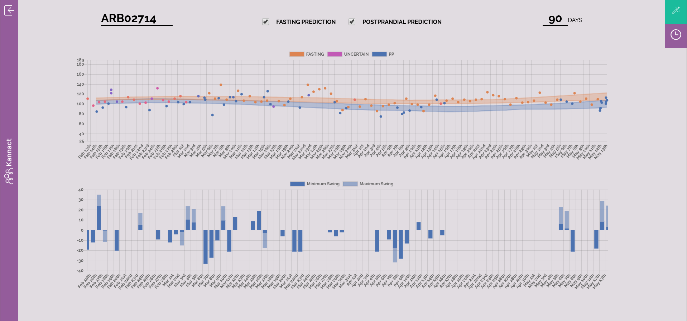

## Project Goal

Create a tool for active management of type II diabetes patients in large populations.

&nbsp;

* Large populations require scalable solutions for gathering data (**\alert{patient-generated data}**).

* Active management implies recognizing problems faster than the traditional process (**\alert{medium-term trends}**).

## Traditional Diabetes Management

Type II diabetes is when cells develop insulin resistence and absorb glucose from the blood slowly. It is diagnosed by the following tests:

1. Glucose level after fasting for 8-10 hours.
2. Glucose level 2 hours after drinking a certain sweet concoction.
3. Hemoglobin A1c test. Correlated with the average blood glucose in the past 2-3 months (a mixture of #1 and #2).

In the traditional medical system, these same tests are administered and examined by doctors in regular check ups every 3-6 months.

## Active Management Companies

Data and inspiration for this problem comes from Kannact.

Kannact is a healthcare technology startup based in the U.S. that manages diabetic populations for employers.

Glucose readings are collected by the patients themselves via provided 4G-connected glucometers.

Kannact employs health coaches to call patients every month. Coaches can see the glucose readings that patients take.

## The data gap

Doctors love the A1c score primarily because it is not effected by the noise of recent meals.

Self-administered glucose measurements are much less reliable than those administered in controlled environments at the doctor's office.

How can a healthcare coach, with less training and worse data than a doctor, hope to recognize problems and intervene?

## Dashboard Screenshot

{height=300px}

([Description in [**Appendix 1**]{.smallcaps}](#project-results))

## The Data

Blood glucose levels at any point in time are caused by two factors:

1. The amount of glucose dumped into the blood when the patient eats.
2. The amount of glucose absorbed from the blood by the cells.

In the tests to determine how the disease is developing, #1 is minimized or controlled. It's noise.

#1, however, contains information about the behavior of the patient and their diet.

## Type II Diabetes - Data

It's important to understand that take-home glucometers have historically been seen as useful for #1: determining the effect of food.

This can be seen in the following screenshot of the product description of one of the most popular glucometer brands:

## Marketing Screenshot (Glucometer)

{height=300px}

## Marketing - Glucose Management

There is a bonanza of new apps to help people manage their diabetes.

The apps focus on short-term changes in glucose: the effects of individual food items on glucose changes and daily changes in levels.

At a daily level, the signal that matters for understanding the evolution of type II diabetes, the biological changes in cells' insulin sensitivity, is lost.

See [[**Appendix 2**]{.smallcaps}](#marketing-screenshots) for marketing screenshots.

## Nowcasting

This is why we have proposed to nowcast the trends traditionally observed at a 3-6 month level, as they evolve on a daily/weekly basis.

## Our Data

The glucometers used in the Kannact data have buttons to label readings as "pre-meal" and "post-meal".

Some patients label all of their readings as "pre-meal" or "post-meal".

Most patients forget some of the time.

Many patients forget all of the time.

## Our Data

{height=300px}

## Process

In order to recover the labels _of interest_ (fasting/postprandial) we need to consider two dimensions:

1. The reading value
2. The time of day in which the reading took place

Where the time of day can help us infer if the reading is taken while fasting (immediately after waking up).

Where possible, we can also take advantage of:

3. The user-provided label (pre-meal/post-meal)

## Label Recovery

{height=300px}

## Model

We formulate a two-component mixture model in two dimensions (mg/dL and time of day):

* We learn the "wakeup time" for each person while allowing postprandial readings at any time in the day: time is thus a Beta for fasting, and uniform for postprandial.

* Glucose levels exhibit heavy tails. Postprandial readings have large positive excursions. We thus learn a symmetric and asymmetric Laplace distribution respectively.

* To recover the smooth time trend in the location parameter of the glucose distributions, we run quantile regression on a Fourier basis transformation of the date value.

See [[**Appendix 3**]{.smallcaps}](#maths) for mathematical formalization.

## Model

{height=180px}

Example of the symmetric and asymmetric Laplace distributions.

## Solving the Model

We develop a novel EM algorithm tailored to our model, which is non-standard in two ways:

1. Uses quantile regression to model evolution of the location parameters of the Laplace distribution over time.

2. Semi-supervised by allowing hard-assigned labels when deemed "reliable".

See associated paper and code for details on implementation.

## Solving the Model

The number of Fourier bases used to represent the time evolution is chosen using information criteria, allowing complexity of non-linearities in the trend to differ per patient.

The evolution of the location parameters is reported with 95% confidence intervals created via bootstrap resampling of the location regression given the best basis function. This crucially allows coaches to see when a patient is taking enough readings to recover the trend.

## Conclusions

Fasting, and postprandial levels represent a combination of information about user behavior and information about the biological transformations happening in the system of a diabetes patient.

Recovering the medium-term trends in the latter are needed to allow patients to see feedback from their exercise and diet regimes.

A focus on recovering medium-term trends is sorely lacking in both medical literature and commercial offerings.

A probabilistic model is necessary to separate signal from noise and provide it in a usable way for health coaches.

## Future Research

Recovering the medium-term trends of the underlying biological process is an important first step that opens up many exciting opportunities:

* Explore reliable predictions of A1c scores using the fasting/postprandial evolution (See [[**Appendix 4**]{.smallcaps}](#predictions) for promising initial results).

* Test for effectiveness of interventions (coaching sessions).

* Test for effectiveness of program with regards to covariates of interest (psychological profiles).

* Test effectiveness of diet and exercise given appropriate data (mobile health apps).

## Appendix 1 - Project Results {#project-results}

The dashboard enables:

* Active-management professionals (health coaches and doctors) to monitor the evolution of key variables for early- and mid-stage type II diabetes patients.

* Coaches and patients to see the effects of short-term diet and exercise behaviors on mediumed- and long-term evolution of the biological process underlying the disease.

* Coaches and patients to see the quality, regularity, and reliability of the blood-glucose readings taken by the patient and the effects of improving.

## Appendix 1 - Project Results

From the noisy signal of raw glucose levels, the dashboard presents the inferred variables that align with the medical theory on managing type II diabetes:

1. Fasting glucose levels and their evolution over time.
2. Postprandial glucose levels and their evolution over time.
3. Daily "swings" in glucose levels that causes cardiovascular stress to the system.

## Appendix 1 - Project Results

Technical results needed to build the dashboard and present these variables in a usable manner:

* Infer the "type" of blood-glucose reading from the partially-labelled patient data provided by the glucometer (fasting/postprandial).

* Infer a "location" parameter for each type of reading that is robust to the outliers and skewness present in patient-recorded glucose data.

* Model the evolution of that location parameter for each patient over time, including prediction and interpolation when missing readings.

## Appendix 2 - Marketing Screenshots {#marketing-screenshots}

{height=300px}

## Appendix 2 - Marketing Screenshots

{height=300px}

## Appendix 2 - Marketing Screenshots

{height=225px}

## Appendix 3 - Model {#maths}

For each patient, we learn the following model:

Let $y_{ij}$ be the $i^{th}$ glucose reading on date $j$ and time $t_{ij} \in [0,24]$.

Let $z_{ij} \in {1,2}$ be the latent fasting/postprandial label. We formulated the following mixture model in two dimensions (glucose and time):

$$
(y_{ij}, t_{ij} | z_{ij} = 1) \sim Laplace(\mu^1_{j}, \sigma^1), \ Beta(\alpha_i, \beta_i)
$$
$$
(y_{ij}, t_{ij} | z_{ij} = 2) \sim Laplace(\mu^2_{j}, \sigma^2, \delta^2), \ Unif(0, 24)
$$

Where we assume $y_{ij} \perp t_{ij} \ | \ z_{ij}$.

## Appendix 3 - Model

In order to allow changes over time, we learn the location parameters, $\mu$, as a function of the date.

This is done via a regression on a non-linear basis transformation of the date value:

$$
\mu^k_j = \textbf{w} \Phi ( j )
$$

Where $\textbf{w}$ is a vector of learned coefficients, $j$ is the date, and $\Phi$ represents the feature transformation function, in this case, a Fourier basis. given the date.

## Appendix 4 - A1c Predictions {#predictions}

Well-controlled medical studies comparing A1C scores with with average fasting and postprandial readings suggest that the correlations between readings and A1c scores should be:

1. For fasting levels, between .46 and .71, the upper end being for populations known to have diabetes. We recovered .66 with our model and patients.

2. For postprandial levels, between .33 and .79. We recovered .54 with our model and patients.

We can also formulate a linear model and find that on our small sample of patients, using our fitted distributions outperforms the average of all readings (see associated paper).

## References

Organization, World Health, and others. 2006. "Definition and
Diagnosis of Diabetes Mellitus and Intermediate Hyperglycaemia:
Report of a Who"

Dempster, Arthur P, Nan M Laird, and Donald B Rubin. 1977.
“Maximum Likelihood from Incomplete Data via the Em
Algorithm.” Journal of the Royal Statistical Society: Series B
(Methodological) 39 (1): 1–22.

Yu, Keming, and Rana A. Moyeed. 2001. “Bayesian Quantile
Regression.” Statistics & Probability Letters 54 (4): 437–47.

Russel, David, and Mark Steel. 2017. “Continuous Mixtures with
Skewness and Heavy Tails.”

## References

Rossell, David, and Francisco J Rubio. 2018. “Tractable Bayesian
Variable Selection: Beyond Normality.” Journal of the American
Statistical Association 113 (524): 1742–58.

Monnier, Louis, Claude Colette, Louis Monnier, and Claude
Colette. 2006. “Contributions of Fasting and Postprandial
Glucose to Hemoglobin A1c.” Endocrine Practice 12 (Supplement
1): 42–46.

Van’t Riet, Esther, Marjan Alssema, Josina M Rijkelijkhuizen, Piet
J Kostense, Giel Nijpels, and Jacqueline M Dekker. 2010.
“Relationship Between A1c and Glucose Levels in the General
Dutch Population: The New Hoorn Study.” Diabetes Care 33 (1):
61–66

## References

Nathan, David M, Judith Kuenen, Rikke Borg, Hui Zheng, David
Schoenfeld, and Robert J Heine. 2008. “Translating the A1c
Assay into Estimated Average Glucose Values.” Diabetes Care 31
(8): 1473–8.
